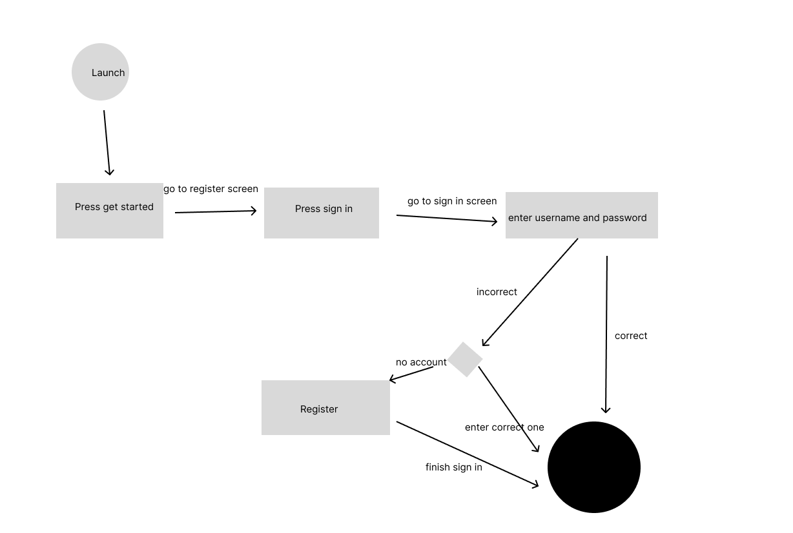
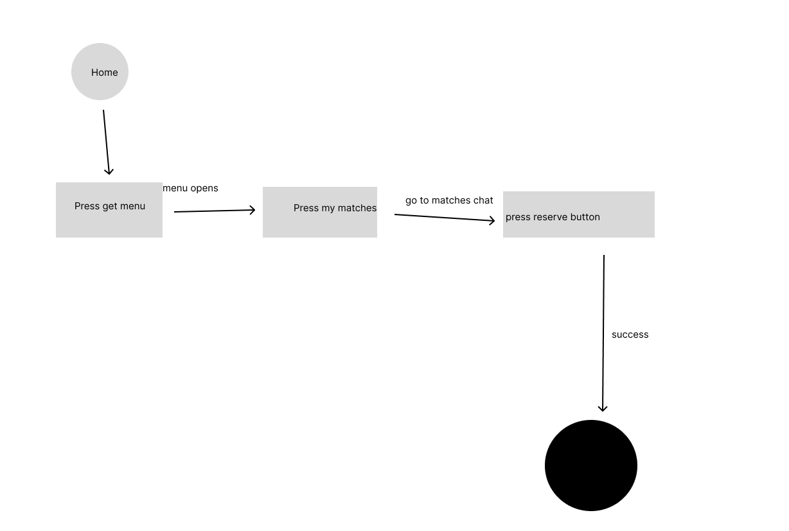

# Specification Phase Exercise

A little exercise to get started with the specification phase of the software development lifecycle. See the [instructions](instructions.md) for more detail.

## Team members

David Shen - [GitHub](https://github.com/SnazzyBeatle115)
## Stakeholders

**Name:** Devon Z.

**Problems:**
* hard to find common ground/fit with date.
* Financial stability (someone who is rich enough to take you out can support you??)
* Difficulty deciding on a place to eat (app will recommend restaurants)
* Unclear expectations around dietary restrictions.

**Needs:** 
* Expressed interest in an app to use common food interests for similarities and conversation starters.
* Expressed interest in finding a community from the app.
* Wants feature to specify preference for who is paying.
* Put favorite restaurant on profile.

## Product Vision Statement

**Foodies** is an app that allows people to match with their food preference partners.
*The dating market is **cooked**.*

## User Requirements

1. As a user, I want to sign up so I can start matching with other users.
2. As a registered user, I want to sign in to my account.
3. As a user, I want to see profiles so I can decide to match.
4. As a user, I want to be able to chat with my matches.
5. As a user, I want to be able to arrange a reservation for a restaurant with my matches.
6. As a user, I want to be able to add restaurants I've been to.

## Activity Diagrams

### User Story 2

### User Story 5

## Clickable Prototype

[Link to Figma](https://www.figma.com/proto/c8uaYAdsRLTjVkwJwfXqPj/Foodies?node-id=5-139&t=vK9ulIPapzhabQGt-1&scaling=scale-down&content-scaling=fixed&page-id=0%3A1&starting-point-node-id=1%3A4)
